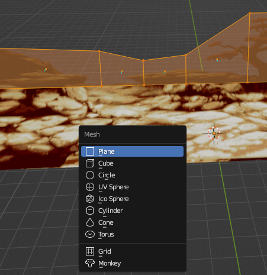
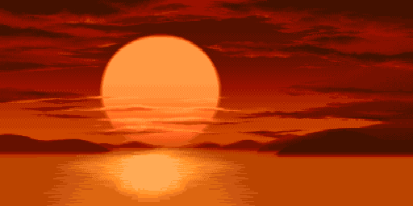

# Making a basic stage for MvC2

## **Requirements**

### Blender - 3D Modeling Software  
    Used for building the stage/scene.  

### Photo Editing Sofware  
    This will be needed to properly setup textures to be used in Blender.  

### PVR Tool
    Used for converting images to .PVR which are the texture format for Dreamcast.

### Python 
    Used for running scripts to join texture files together to make TEX.BIN (namely buildTEX.py)  
    I use Python3, 3.8 via Pycharm and 3.10 via venv.

### SH4 Assembler (Made by Anotak)
    Thanks to Anotak we can create .bin files from data and SH4 code written in .asm files.

## **Starting from Sprite assets**
    First we must find a stage that we want to make. In this section we will be starting with sprite assets. We will start with the following stage from SFA3.  

### Street Fighter Alpha/Zero 3 - Ryu's Stage

    I got these assets from PalMod which were ripped by derek.

### Things to Note
    The hardest parts of these stages are four main things we need to watch out for.  
    1. The Floor - Usually what we start making to ensure we have a good foundation.  
    2. Splitting the Assets - Ensure we can create depth when putting the stages together.
    3. Texture Size - We want to stick with power of two in width and height starting from 2 to 1024. (2,4,8,16,32,64,128,256,512,1024). 
    4. Memory Limits - There are limits to memory usage which I will talk about later. I go by the largest TEX.BIN file in default MvC2 which is 1,632 KB.

## **Starting to split assets**

### **The Floor**

> Asset 02 from PalMods SFA3 Ryu's Stage Assets

    In the past I have done multiple versions of floors that curve up to meet middle ground assets. Here are some examples:  
### SFA2 - Sakura's House
  

### XMvSF - The Cataract  
  
> It can be somewhat simple if the stage is on a cliff or edge of somekind.  
> Another thing to note is the more layers of transparency you have close to the axis of play, the more lag that will be present in hardware. Emulation seems to be excempt from this.

### SFA - Venezuela
  

### SFA2 - Suzaku Castle

### Side Note
These stages are not optimized for performance on hardware. These stages are examples of the performance differences in software emulation and hardware.  
New methods have been tested to determine the causes of lag but are still not as great in terms of quality as pervious methods.  
This tutorial will not be focused on performance optimizations for the time being as new methods have not been refined.
This tutorial will focus on the basics of making a stage.

### **Continuing with Floor**
I think the best course of action for SFA3 - Ryu's Stage is to make it similar to Venezuela and SFA2 Suzaku Castle.  
So now we need to cut out a piece of the floor to use for the foundation.

Here is Suzaku Castle's Floor texture:  
>   
> 1024px width by 64px height  

We are just going to cutout a section from our floor asset:
>   

Here is our test floor, hopefully it looks ok:
>   
> 1024px width by 64px height  
> I am considering filling in the top right corner to make it a filled rectangular texture and have the texture be RGB565, but for now since theres is transparent section we will have it be ARGB1555.  

Since I am reusing SFA2's Suzaku Castle's Model I made I'll just replace the texture:
> 

The way I did this was replacing the texture via folder button here on the right side:
>   

    Make sure you have the model you want to replace the texture selected.
    1. Click Texture Tab
    2. Look for Image Texture Area
    3. Click folder to open texture

## **Middle Ground**

To start off I made a copy of the middle ground to keep things in as reference before I start messing things up:
> 

Here is the middle ground texture for SFA2's Suzaku Castle:
>   
> 1024px width by 512px height  

That is a big texture!  
So next after separating segments of SFA3's Ryu Stage we have this:
>   
> 1024px width by 256px height  

The next step will be to replace and adjust the textures and planes. So following the same way we replaced the floor will replace the MG image texture:
> 
> Now obviously this doesnt look right so we need to adjust them, making sure we have the proper mesh selected lets start to adjust them from front to back.  

> The way we do this is to select the area we want to adjust:  
> 

> At the top select UV Editing Tab:  
>   

> You should see something like this:  
> 

Since I opted to have a smaller texture and cramp things together I will need to adjust the mesh to avoid showing anything it doesnt need to show but first I want to pin the UV properly to the floor. To do this I will adjust the right side of the UV and match up the floor.  

Before:  
>   

After:
>   
> You can see the red verticies of the UV mapping which means that they are pinned. This will come in handy when we need to unwrap an edited mesh to include all of the tree.  
> As you can see the rectangualar plane mesh is not including the entire tree:  
>   
> So lets get started on editing the mesh to incorporate the tree!

### **Editing the Mesh**
So to start off we will use loop cut to make new vertical edges:
In edit mode:  
    1. We select the Loop Cut tool on the tool bar and we hover over to the middle of the area we want to cut.  
    2. When we hover it will give a yellow line as a preview of the cut, generally it will find a way to cut a 'loop' into areas to evenly divide it. So click to cut.  

Preview of cut shown:  
> 

Here are some cuts I made:  
> 

Now I'm going to move them around to help incorporate the tree.  

I ended up doing more loop cuts and moved around the edges:  
> 

Next we need to unwrap it and make more adjustments to ensure the tree is shown properly, we can press 'U', and regular 'Unwrap', or right click our selection. OH and we need to be in Face mode for face context menu:  
> 

Things generated badly for me, after some time I finally remember the pinning of the textures is what needs to be removed for the INNER points:  
>   

You can unpin the by pressing Alt+P or right clicking and hitting Unpin to unpin already pinned UV verticies.  

After some moving around and unwraps I got it to look like this:  
> 

So next we need to apply some more middle ground stuff such as the castle in the distance.  
Since we copied the Middle Ground, lets delete some planes and lets make a new one and apply a texture to it.

In edit mode with the MG selected press Shift+A to add a new shape:  
> 

Here are the settings I put, they dont matter since we are going to move the veritices around.
What matters most is the rotation about the x-axis being -90d:  
> 

After some adjustments we get this:  
> 

I'll add the big tree a bit later for now lets add a new mesh for the background.  
In object mode press Shift+A > Mesh > Plane:  
> 

After some adjustemts in editing mode we get this, and now we need to prepare and add the texture to it:  
> 

Here is the texture we are using:  
>   
> 512px width by 256px height  

Now to apply it, on the right side:
    1. Click Texture Tab 
    2. Add a new material
    3. Click the Yellow Orb/Dot next to Base Color
    4. Click Image Texture under Texture Category
    5. Click the Folder in the Image Texture Area
    6. Select Texture
    7. Adjust as needed

After some adjustments we get:  
> 

I think we can start testing this so now we need to start on Exporting...  

## **TO BE CONTINUED**