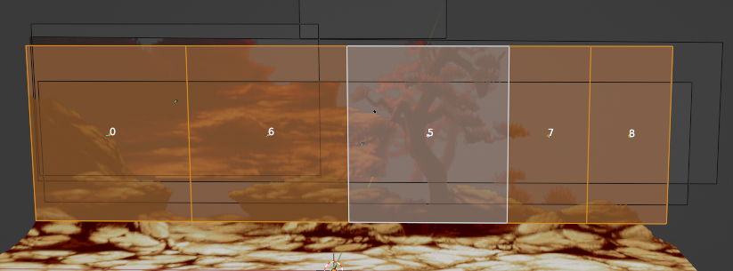
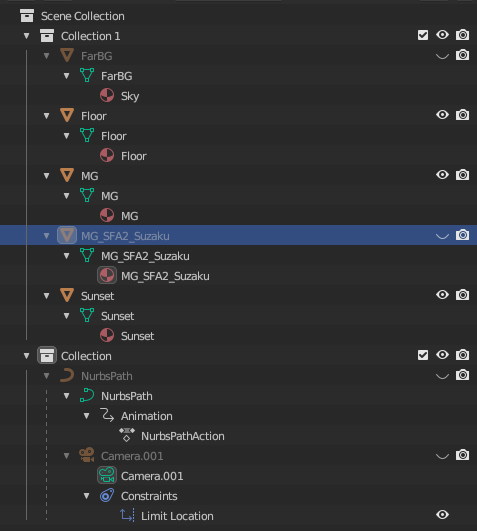
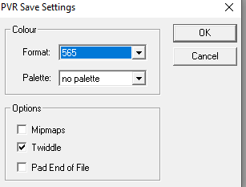

# Making a basic stage for MvC2

## **Requirements**

### **Blender - 3D Modeling Software**  
    Used for building the stage/scene.  
Link: https://www.blender.org/download/  

### **Photo Editing Sofware**  
    This will be needed to properly setup textures to be used in Blender.  

### **PVR Tool**
    Used for converting images to .PVR which are the texture format for Dreamcast.

    Small and great .PVR files viewer & editor for SEGA Dreamcast.

    Main features:
        Open various files type like png, bmp, jpg, pcx, tiff, tga and convert them to PVR graphics.
        PVR Tool indentify Global Index, Pixel format, Alpha Channel, VQ, Mipmaps etc.
        GUI or DOS version.
        Batch encoding (DOSPVR).
Link: https://www.romhacking.net/utilities/1463/  

### **Python** 
    Used for running scripts to join texture files together to make TEX.BIN (namely buildTEX.py)  
    I use Python3, 3.8 via Pycharm and 3.10 via venv.

### **SH4 Assembler (Made by Anotak)**
    Thanks to Anotak we can create .bin files from data and SH4 code written in .asm files.

### **GDROM Explorer**  
    GDROM Explorer is a small tool that enables you to view and extract all data from SEGA Dreamcast and Naomi disc images.

    Main features:
        Multiple file format support: org.GD-ROM Image (.gdi), Mode 1 binary image (.bin), ISO9660 image (.iso) and Padus DiscJuggler (.cdi).
        IP.BIN/IP0000.BIN viewer
        Primary Volume Descriptor viewer
        MR image extraction and conversion
        Cue sheet creation
        Sort file creation
        Extract files (IP.BIN and IP0000.BIN included)
        Support drag’n drop to extract files to the Windows Explorer
        Convert GD-DA (raw audio tracks) to CD-DA
        Encrypt/Decrypt Naomi b
Link: https://www.romhacking.net/utilities/1459/  

## **Starting from Sprite assets**
    First we must find a stage that we want to make. In this section we will be starting with sprite assets. We will start with the following stage from SFA3.  

### Street Fighter Alpha/Zero 3 - Ryu's Stage

    I got these assets from PalMod which were ripped by derek.

### Things to Note
    The hardest parts of these stages are four main things we need to watch out for.  
    1. The Floor - Usually what we start making to ensure we have a good foundation.  
    2. Splitting the Assets - Ensure we can create depth when putting the stages together.
    3. Texture Size - We want to stick with power of two in width and height starting from 2 to 1024. (2,4,8,16,32,64,128,256,512,1024). 
    4. Memory Limits - There are limits to memory usage which I will talk about later. I go by the largest TEX.BIN file in default MvC2 which is 1,632 KB.

## **Starting to split assets**

### **The Floor**

> Asset 02 from PalMods SFA3 Ryu's Stage Assets

    In the past I have done multiple versions of floors that curve up to meet middle ground assets. Here are some examples:  
### SFA2 - Sakura's House
  

### XMvSF - The Cataract  
  
> It can be somewhat simple if the stage is on a cliff or edge of somekind.  
> Another thing to note is the more layers of transparency you have close to the axis of play, the more lag that will be present in hardware. Emulation seems to be excempt from this.

### SFA - Venezuela
  

### SFA2 - Suzaku Castle

### Side Note  

> These stages are not optimized for performance on hardware. These stages are examples of the performance differences in software emulation and hardware.  
> New methods have been tested to determine the causes of lag but are still not as great in terms of quality as pervious methods.  
> This tutorial will **NOT** be focused on performance optimizations for the time being as new methods have not been refined.  
> This tutorial will focus on the basics of making a stage.

### **Continuing with Floor**
I think the best course of action for SFA3 - Ryu's Stage is to make it similar to Venezuela and SFA2 Suzaku Castle.  
So now we need to cut out a piece of the floor to use for the foundation.

Here is Suzaku Castle's Floor texture:  
>   
> 1024px width by 64px height  

We are just going to cutout a section from our floor asset:
>   

Here is our test floor, hopefully it looks ok:
>   
> 1024px width by 64px height  
> I am considering filling in the top right corner to make it a filled rectangular texture and have the texture be RGB565, but for now since theres is transparent section we will have it be ARGB1555.  

Since I am reusing SFA2's Suzaku Castle's Model I made I'll just replace the texture:
> 

The way I did this was replacing the texture via folder button here on the right side:
>   

    Make sure you have the model you want to replace the texture selected.
    1. Click Texture Tab
    2. Look for Image Texture Area
    3. Click folder to open texture

## **Middle Ground**

To start off I made a copy of the middle ground to keep things in as reference before I start messing things up:
> 

Here is the middle ground texture for SFA2's Suzaku Castle:
>   
> 1024px width by 512px height  

That is a big texture!  
So next after separating segments of SFA3's Ryu Stage we have this:
>   
> 1024px width by 256px height  

The next step will be to replace and adjust the textures and planes. So following the same way we replaced the floor will replace the MG image texture:
>   
> Now obviously this doesnt look right so we need to adjust them, making sure we have the proper mesh selected lets start to adjust them from front to back.  

> The way we do this is to select the area we want to adjust:  
> 

> At the top select UV Editing Tab:  
>   

You should see something like this:  
> 

Since I opted to have a smaller texture and cramp things together I will need to adjust the mesh to avoid showing anything it doesnt need to show but first I want to pin the UV properly to the floor. To do this I will adjust the right side of the UV and match up the floor.  

Before:  
>   

After:
>   
> You can see the red verticies of the UV mapping which means that they are pinned. This will come in handy when we need to unwrap an edited mesh to include all of the tree.  
> As you can see the rectangualar plane mesh is not including the entire tree:  
>   
> So lets get started on editing the mesh to incorporate the tree!

### **Editing the Mesh**  

So to start off we will use loop cut to make new vertical edges:  

    In edit mode:  
    1. We select the Loop Cut tool on the tool bar and we hover over to the middle of the area we want to cut.  
    2. When we hover it will give a yellow line as a preview of the cut, generally it will find a way to cut a 'loop' into areas to evenly divide it. So click to cut.  

Preview of cut shown:  
> 

Here are some cuts I made:  
> 

Now I'm going to move them around to help incorporate the tree.  

I ended up doing more loop cuts and moved around the edges:  
> 

Next we need to unwrap it and make more adjustments to ensure the tree is shown properly, we can press 'U', and regular 'Unwrap', or right click our selection. OH and we need to be in Face mode for face context menu:  
> 

Things generated badly for me, after some time I finally remember the pinning of the textures is what needs to be removed for the INNER points:  
>   

You can unpin the by pressing Alt+P or right clicking and hitting Unpin to unpin already pinned UV verticies.  

After some moving around and unwraps I got it to look like this:  
> 

So next we need to apply some more middle ground stuff such as the castle in the distance.  
Since we copied the Middle Ground, lets delete some planes and lets make a new one and apply a texture to it.

In edit mode with the MG selected press Shift+A to add a new shape:  
> 

Here are the settings I put, they dont matter since we are going to move the veritices around.
What matters most is the rotation about the x-axis being -90d:  
> 

After some adjustments we get this:  
> 

I'll add the big tree a bit later for now lets add a new mesh for the background.  
In object mode press Shift+A > Mesh > Plane:  
> 

After some adjustemts in editing mode we get this, and now we need to prepare and add the texture to it:  
> 

Here is the texture we are using:  
>   
> 512px width by 256px height  

### Adding Texture to New Mesh  

    Now to apply it, on the right side:
    1. Click Texture Tab 
    2. Add a new material
    3. Click the Yellow Orb/Dot next to Base Color
    4. Click Image Texture under Texture Category
    5. Click the Folder in the Image Texture Area
    6. Select Texture
    7. Adjust as needed

After some adjustments we get:  
> 

I think we can start testing this so now we need to start on Exporting...  

## **Part 2 - Exporting .asm files**

### Parameters in Blender Script

Ok so I made this script, it took me a long time to get orientation working correctly.  

Lets look at the parameters, well first at the top click the **Script** Tab:  
>   

The main important parameters we need to focus on are `dir`, `projectName`, and `gradient_flag`.

**`dir`**
> I recommend pointing to the SFA3_RyuStage in the repo using absolute path.  
> For me I am going to have it point to my project folders where I have all my custom MvC2 stages.  

    dir = 'G:\\Files\\Projects\\Python\\TextureData\\POL_TEX_Dump\\Output\\Custom\\' + game_name + '\\' + projectName + '\\Models\\include\\'

> For you, you can put the SFA3_RyuStage folder anywhere or rename it but try to keep the dir end with

    '\\Models\\include\\'  
    Such as:  
    C:\\Projects\\MyMvC2Stage\\Models\\include\\  

**`projectName`**

Usually should be named your stage name as one single string. In this case for me its SFA3_RyuStage.

**`gradient_flag`**

This should be False if you are exporting textured Meshes with **NO VERTEX COLORS**, while we have not incorporated any vertex painting in this model it is used when there are vertex colors.  
If set to true, you should also toggle visibility off to all non vertex painted meshes.

Now, before we continue lets make sure all our meshes are properly set to origin as center.

   1. Go back to the Layout tab.
   2. Set to Object Mode
   3. Hit A, to select all.
   4. Hit Ctrl+A, then click All Transforms
   5. Do this if you ever move or edit things in Object Mode.

Now lets make sure we are only output the Meshes we want. Toggle all Meshes we dont want off in visibilty. Here is my scene collection:  
>   
> The 3 Meshes I have enabled in visibilty is `Floor`, `MG`, and `Sunset`.

Lets go back to the `Script` tab. **Make sure your parameters are set right!**  

Now hit the Play button at the top.  

    ☑ bpy.ops.text.run_script()

You should see that in the console on the bottom left. If there is a red X then you rpobably have errors in the parameters or have a mesh or polygon with more than 4 vertices.  
The soluction to the latter is to have face mode on, and Triangulate faces. I recommend then turning Tris to Quads to minimize the amount of vertex data written.  
To explain this simply imagine a square and you listed the verticies. [1,2,3,4]  
Now imagine describing it as two triangles. [1, 2, 3], [4, 2, 3]. This listing has 2 repeated verticies.   

### Checking our output

If things went correctly you should get .asm files generated in your output directory.  
Here is my output directory:  
> 

### Creating a Singular Model File
So now, we need to create headers for these models. I will provide two files:

    SFA2_SuzakuCastle_v000.asm
    custom_SFA2_SuzakuCastle_POL.asm

Make a copy of both and rename to your project such as:

    custom_SFA3_RyuStage_POL.asm
    SFA3_RyuStage_v000.asm

What we will be focusing on right now is making a singular model file so we will be focusing on `SFA3_RyuStage_v000.asm`  
Now what I do is I "Find and Replace", find "SFA2_SuzakuCastle" and replace with "SFA3_RyuStage"

Before

    ; SFA2_SuzakuCastle_v000.asm
    ; sh4_asm.exe SFA2_SuzakuCastle_v000.asm SFA2_SuzakuCastle_v000.bin 0x00

    ; Main_Header_SFA2_SuzakuCastle_v000:
        #data 0x00000001    ;  Obj Format
        #data 0x00000003    ;  Flags
        #data 0x00000000    ;  Centroid X
        #data 0x00000000    ;  Centroid Y
        #data 0x00000000    ;  Centroid Z
        #data 0x49A1C0FE    ;  Radius?

    ; SFA2_SuzakuCastle_FarBG_Header:
    ...  

After

    ; SFA3_RyuStage_v000.asm
    ; sh4_asm.exe SFA3_RyuStage_v000.asm SFA3_RyuStage_v000.bin 0x00

    ; Main_Header_SFA3_RyuStage_v000:
        #data 0x00000001    ;  Obj Format
        #data 0x00000003    ;  Flags
        #data 0x00000000    ;  Centroid X
        #data 0x00000000    ;  Centroid Y
        #data 0x00000000    ;  Centroid Z
        #data 0x49A1C0FE    ;  Radius?

    ; SFA3_RyuStage_FarBG_Header:
    ...  

This is ofcourse done throughout the file.  
Now we should go over what header files are for what...

## **Header Cheat Sheet**

    1. ALL NON TRANSPARENT MESHES SHOULD BE LISTED FIRST!
    2. NOT ALL HEADERS ARE DOCUMENTED BUT THESE WORK FOR ME

Headers:

    1. If your mesh is composed of vertex colors use:
    ; SFA3_RyuStage_FarBG_Header:
        #data 0x8000001D    ; Mesh Param [Param/Flags]?
        #data 0x83400000    ; [Param/Flags]
        #data 0x20880440    ; [Param/Flags]
        #data 0x04000000    ; [Param/Flags]
        #data 0x00000000    ; Centroid X [Float]
        #data 0x00000000    ; Centroid Y [Float]
        #data 0x00000000    ; Centroid Z [Float]
        #data 0x48A1C0FE    ; Radius     [Float]
        #data 0xFFFFFFFF    ; TextureID  [UINT-8]
        #data 0xFFFFFFFD    ; TexHandle
        #data 0x3F800000    ; ?????????
        #data 0x3F800000    ; Base Alpha [Float]
        #data 0x3F800000    ; Base Red   [Float]
        #data 0x3F800000    ; Base Green [Float]
        #data 0x3F800000    ; Base Blue  [Float]
        #data 0x00000000    ; Offs Alpha [Float]
        #data 0x00000000    ; Offs Red   [Float]
        #data 0x00000000    ; Offs Green [Float]
        #data 0x00000000    ; Offs Blue  [Float]
    ; SFA3_RyuStage_FarBG_Data:

    2. If your mesh is just a non transparent texture use:
    ; SFA3_RyuStage_Floor_Header:
        #data 0x8000002C    ; Mesh Param [Param/Flags]?
        #data 0x82000000    ; [Param/Flags]
        #data 0x9488047B    ; [Param/Flags]
        #data 0x08000000    ; [Param/Flags]
        #data 0x00000000    ; Centroid X [Float]
        #data 0x00000000    ; Centroid Y [Float]
        #data 0x00000000    ; Centroid Z [Float]
        #data 0x48A1C0FE    ; Radius     [Float]
        #data 0x00000000    ; TextureID  [UINT-8]
        #data 0xFFFFFFFF    ; TexHandle
        #data 0x3F800000    ; ?????????
        #data 0x3F800000    ; Base Alpha [Float]
        #data 0x3F800000    ; Base Red   [Float]
        #data 0x3F800000    ; Base Green [Float]
        #data 0x3F800000    ; Base Blue  [Float]
        #data 0x00000000    ; Offs Alpha [Float]
        #data 0x00000000    ; Offs Red   [Float]
        #data 0x00000000    ; Offs Green [Float]
        #data 0x00000000    ; Offs Blue  [Float]
    ; SFA3_RyuStage_Floor_Data:

    3. If your mesh is a texture with transparency use:
    ; SFA3_RyuStage_MG_Header:
        #data 0x8200002C    ; Mesh Param [Param/Flags]?
        #data 0x82000000    ; [Param/Flags]
        #data 0x9480047D    ; [Param/Flags]
        #data 0x00000000    ; [Param/Flags]
        #data 0x00000000    ; Centroid X [Float]
        #data 0x00000000    ; Centroid Y [Float]
        #data 0x00000000    ; Centroid Z [Float]
        #data 0x48A1C0FE    ; Radius     [Float]
        #data 0x00000001    ; TextureID  [UINT-8]
        #data 0xFFFFFFFF    ; TexHandle
        #data 0x3F800000    ; ?????????
        #data 0x3F800000    ; Base Alpha [Float]
        #data 0x3F800000    ; Base Red   [Float]
        #data 0x3F800000    ; Base Green [Float]
        #data 0x3F800000    ; Base Blue  [Float]
        #data 0x00000000    ; Offs Alpha [Float]
        #data 0x00000000    ; Offs Red   [Float]
        #data 0x00000000    ; Offs Green [Float]
        #data 0x00000000    ; Offs Blue  [Float]
    ; SFA3_RyuStage_MG_Stuff_Data:

Ok now lets actually analyze our meshes and match up headers and texture IDs.  
So our `Floor` and `MG` have transparency textures and do not use vertex colors so we need to use header 3 for both.
Our `Sunset` mesh has no transparency and no vertex colors so we need to use header 2.

Since we need to list **`NON TRANSPARENT MESHES FIRST`**, our mesh order should be `Sunset`, `Floor`, `MG` or `Sunset`, `MG`, `Floor`.

Following the mesh header we need to add the .asm file we exported from Blender.

So the file starts with:

    ; SFA3_RyuStage_v000.asm
    ; sh4_asm.exe SFA3_RyuStage_v000.asm SFA3_RyuStage_v000.bin 0x00

    ; Main_Header_SFA3_RyuStage_v000:
        #data 0x00000001    ;  Obj Format
        #data 0x00000003    ;  Flags
        #data 0x00000000    ;  Centroid X
        #data 0x00000000    ;  Centroid Y
        #data 0x00000000    ;  Centroid Z
        #data 0x49A1C0FE    ;  Radius?

Followed by `Sunset` mesh header:

    ; SFA3_RyuStage_Sunset_Header:
        #data 0x8000002C    ; Mesh Param [Param/Flags]?
        #data 0x82000000    ; [Param/Flags]
        #data 0x9488047B    ; [Param/Flags]
        #data 0x08000000    ; [Param/Flags]
        #data 0x00000000    ; Centroid X [Float]
        #data 0x00000000    ; Centroid Y [Float]
        #data 0x00000000    ; Centroid Z [Float]
        #data 0x48A1C0FE    ; Radius     [Float]
        #data 0x00000002    ; TextureID  [UINT-8]
        #data 0xFFFFFFFF    ; TexHandle
        #data 0x3F800000    ; ?????????
        #data 0x3F800000    ; Base Alpha [Float]
        #data 0x3F800000    ; Base Red   [Float]
        #data 0x3F800000    ; Base Green [Float]
        #data 0x3F800000    ; Base Blue  [Float]
        #data 0x00000000    ; Offs Alpha [Float]
        #data 0x00000000    ; Offs Red   [Float]
        #data 0x00000000    ; Offs Green [Float]
        #data 0x00000000    ; Offs Blue  [Float]
    ; SFA3_RyuStage_Sunset_Data:

Also I edited the texture ID to `#data 0x00000002    ; TextureID  [UINT-8]`

Followed by the module with our exported .asm:

    ; SFA3_RyuStage_Sunset_Data:
        #module "include/SFA3_RyuStage_Sunset_00.asm"

So lets do `MG` and `Floor`:

    ; SFA3_RyuStage_MG_Header:
        #data 0x8200002C    ; Mesh Param [Param/Flags]?
        #data 0x82000000    ; [Param/Flags]
        #data 0x9480047D    ; [Param/Flags]
        #data 0x00000000    ; [Param/Flags]
        #data 0x00000000    ; Centroid X [Float]
        #data 0x00000000    ; Centroid Y [Float]
        #data 0x00000000    ; Centroid Z [Float]
        #data 0x48A1C0FE    ; Radius     [Float]
        #data 0x00000001    ; TextureID  [UINT-8]
        #data 0xFFFFFFFF    ; TexHandle
        #data 0x3F800000    ; ?????????
        #data 0x3F800000    ; Base Alpha [Float]
        #data 0x3F800000    ; Base Red   [Float]
        #data 0x3F800000    ; Base Green [Float]
        #data 0x3F800000    ; Base Blue  [Float]
        #data 0x00000000    ; Offs Alpha [Float]
        #data 0x00000000    ; Offs Red   [Float]
        #data 0x00000000    ; Offs Green [Float]
        #data 0x00000000    ; Offs Blue  [Float]
    ; SFA3_RyuStage_MG_Stuff_Data:
        #module "include/SFA3_RyuStage_MG_00.asm"
        
    ; SFA3_RyuStage_Floor_Header:
        #data 0x8200002C    ; Mesh Param [Param/Flags]?
        #data 0x82000000    ; [Param/Flags]
        #data 0x9480047D    ; [Param/Flags]
        #data 0x00000000    ; [Param/Flags]
        #data 0x00000000    ; Centroid X [Float]
        #data 0x00000000    ; Centroid Y [Float]
        #data 0x00000000    ; Centroid Z [Float]
        #data 0x48A1C0FE    ; Radius     [Float]
        #data 0x00000000    ; TextureID  [UINT-8]
        #data 0xFFFFFFFF    ; TexHandle
        #data 0x3F800000    ; ?????????
        #data 0x3F800000    ; Base Alpha [Float]
        #data 0x3F800000    ; Base Red   [Float]
        #data 0x3F800000    ; Base Green [Float]
        #data 0x3F800000    ; Base Blue  [Float]
        #data 0x00000000    ; Offs Alpha [Float]
        #data 0x00000000    ; Offs Red   [Float]
        #data 0x00000000    ; Offs Green [Float]
        #data 0x00000000    ; Offs Blue  [Float]
    ; SFA3_RyuStage_MG_Floor_Data:
        #module "include/SFA3_RyuStage_Floor_00.asm"

`MG` will use Texture ID `0x01` and `Floor` will use Texture ID `0x00`:

    SFA3_RyuStage-TexID_0x00-Floor.png
    SFA3_RyuStage-TexID_0x01-MG.png
    SFA3_RyuStage-TexID_0x02-FarBG.png

Now for the end of this singular model file in Blender at the top Click `Window` > `Toggle System Console`. 
Should show something similar to the following after running a script:

    ; OBJ END
    end_obj:
        #data 0x00000000
        #data 0x00000024

The data above is 0x00000000 to end the file, and the following number is the # of verticies in hexidecimal, this part isnt too curcial but helps verifying.

## Building the Model

So now it gets a bit more complex cause we need to use the SH4 Assembler made by `Anotak`, `sh4_asm.exe`.

I created a folder for this application and added it to my system `PATH`, so now I can call it via Command Prompt via any directory.  
For you, it might just be a good idea to extract the .exe into your `Models` folder with your `<projectName>_v000.asm`.

So assuming youre in Windows, in your Models folder, press `ALT+D`, it should highlight your folder URL, type `cmd` and press enter.  
It should open the command prompt, for me it looks like:  

    G:\Files\Projects\Python\TextureData\POL_TEX_Dump\Output\Custom\MvC2\SFA3_RyuStage\Models>_

I ran the command:
    
    G:\Files\Projects\Python\TextureData\POL_TEX_Dump\Output\Custom\MvC2\SFA3_RyuStage\Models>sh4_asm.exe SFA3_RyuStage_v000.asm SFA3_RyuStage_v000.bin 0x00
    asm using offset 00

So now I have a `SFA3_RyuStage_v000.bin` in the Models folder and is our singular model file.

The way `sh4_asm.exe` works is the syntax: `sh4_asm.exe <input .asm file location> <output .bin file location> <starting offset for labels>`  
Our input file <input .asm file location> is `SFA3_RyuStage_v000.asm`  
Our output file <output .bin file location> is `SFA3_RyuStage_v000.bin` 
Since we dont need to offset this model our <starting offset for labels> is 0x00  
So the command is: `sh4_asm.exe SFA3_RyuStage_v000.asm SFA3_RyuStage_v000.bin 0x00`  
I also put the command for easy copy pasting at the top of the file commented out so sh4_asm.exe doesnt think its data.  

## Building TEX.BIN

So now we need to convert our textures into PVRs via PVR Tool  
We have 3 Textures for this stage.  

    SFA3_RyuStage-TexID_0x00-Floor.png
    SFA3_RyuStage-TexID_0x01-MG.png
    SFA3_RyuStage-TexID_0x02-FarBG.png

Lets convert `SFA3_RyuStage-TexID_0x00-Floor.png`, since we know it has transparency we will be saving it as a `ARGB1555` PVR Texture.  
You can get PVR Tool from the romhacking site under utilities for Dreamcast.  
We open up the program and drag it in.  

We need to then vertically flip it via `Tools` > `Flip Vertically`  

Now we need to save it via `File` > `Save as...`, leading to the window:  

Save it in the `<ProjectFolder>/Textures/PVRs/`

Do the same for `SFA3_RyuStage-TexID_0x01-MG.png`

So now we do about the same for `SFA3_RyuStage-TexID_0x02-FarBG.png` but instead we save it as `RGB565` PVR Texture:  
  

So now we have 3 converted textures as .pvr files:  
  

So now we need to use the `buildTEX.py` script I made to build the TEX.BIN file

If you installed Python 3 you should be able to run the command:

    ><python.exe location> -m <buildTEX location> <projectFolder> stage

For me the command is:

    >python -m buildTEX G:\Files\Projects\Python\TextureData\POL_TEX_Dump\Output\Custom\MvC2\SFA3_RyuStage stage  

The output for me is:

    SFA3_RyuStage-TexID_0x00-Floor.pvr
    SFA3_RyuStage-TexID_0x01-MG.pvr
    SFA3_RyuStage-TexID_0x02-FarBG.pvr

        #data 0x0400 0x0040 0x00 0x0D 0x0000 0x0CC00000 0x00000000 ; RyuStage, Ends @ 0x0CC20000, Size: 0x00020000
        #data 0x0400 0x0100 0x00 0x0D 0x0000 0x0CC20000 0x00000000 ; RyuStage, Ends @ 0x0CCA0000, Size: 0x00080000
        #data 0x0200 0x0100 0x01 0x0D 0x0000 0x0CCA0000 0x00000000 ; RyuStage, Ends @ 0x0CCE0000, Size: 0x00040000
        ; NOT suitable for STG0B, total space used: 0xE0000 should be <= 0x98000
        ; Remaining space is 0x000B8000
        #data 0x0000 0x0000 0x00 0x00 0x0000 0x00000000 0x00000000 ; END

And we now have a `TEX.BIN` in the `<projectFolder>\Textures\PVRs\` folder.

## Building POL.BIN

Moving onto POL.asm

    ; custom_SFA3_RyuStage_POL.asm
    ; sh4_asm.exe custom_SFA3_RyuStage_POL.asm build/STG02POL.BIN 0x0CEA0000
    BEG:
        #data ModelTable 0x00000001 TextureTable Model_000

    ModelTable:
        #data Model_000
        #data 0x00000000 ; EndModelTable
        #align16

    TextureTable:
        ; PUT TEXTURE TABLE LIST HERE
        #data 0x0000 0x0000 0x00 0x00 0x0000 0x00000000 0x00000000 ; END
    
    Model_000:
        #import_raw_data "SFA3_RyuStage_v000.bin"

    STG_END:
        #data 0x00000000
        #align16

Pasting Texture List:

    ; custom_SFA3_RyuStage_POL.asm
    ; sh4_asm.exe custom_SFA3_RyuStage_POL.asm build/STG02POL.BIN 0x0CEA0000
    BEG:
        #data ModelTable 0x00000001 TextureTable Model_000

    ModelTable:
        #data Model_000
        #data 0x00000000 ; EndModelTable
        #align16

    TextureTable:
        #data 0x0400 0x0040 0x00 0x0D 0x0000 0x0CC00000 0x00000000 ; RyuStage, Ends @ 0x0CC20000, Size: 0x00020000
        #data 0x0400 0x0100 0x00 0x0D 0x0000 0x0CC20000 0x00000000 ; RyuStage, Ends @ 0x0CCA0000, Size: 0x00080000
        #data 0x0200 0x0100 0x01 0x0D 0x0000 0x0CCA0000 0x00000000 ; RyuStage, Ends @ 0x0CCE0000, Size: 0x00040000
        ; NOT suitable for STG0B, total space used: 0xE0000 should be <= 0x98000
        ; Remaining space is 0x000B8000
        #data 0x0000 0x0000 0x00 0x00 0x0000 0x00000000 0x00000000 ; END
        
    Model_000:
        #import_raw_data "SFA3_RyuStage_v000.bin"

    STG_END:
        #data 0x00000000
        #align16

Now we run the sh4_asm.exe application again from Models folder with command:

    sh4_asm.exe custom_SFA3_RyuStage_POL.asm build/STG02POL.BIN 0x0CEA0000

We then now have `STG02POL.BIN` in folder `<projectFolder>\Models\build\`

## TEX.BIN and POL.BIN

So now we have both a POL.BIN and TEX.BIN pair. So now we need to test it in game and see if we need to make any adjustments.

## Building a Game

So if youre even trying to modify the game you'll probably need a dump of the game. I recommend using a digital copy of your game in the format of GDI.

So first we need to open up the game in GDROM Explorer:  
> 

You can click a file like the 1ST_READ.BIN and hit CTRL+A to select all, click and drag into an empty project folder such as: `G:\Projects\MvC2\`

Since we are trying to replace stages we need to have a custom 1ST_READ.BIN and hopefully have a matching IP.BIN file:  
> What I mean by matching IP.BIN is that the IP.BIN is the boot sector of the game that loads up first and points to where the game needs to start running, these values differe from CDI to GDI  
> Typically GDI has a value of about `45000` + 150 offset  
> We can view the games IP.BIN via GDROM Explorer by double clicking the IP.BIN on the left side of the directory listing  
> Or after extracting pointing to it via `Tools` > `IP.BIN Viewer`,  opening and looking at `Track List` tab:
### **IP.BIN VIEWING**  
> 

After a bit of research it seems that most base game CDI mixes also have 45000 as LBA value, if its a multimix it morethan likely has an LBA of 11720, and there are some mixes that have LBA of 0.

Moving onto getting a 1ST_READ.BIN.

### **PAXTEZ Site**
Link: https://paxtez.zachd.com/  
>   
Huge thanks to Paxtez for making a site to allow easier game modifications from allowing 16 Color Expansion Mod by Jed, or the Tracklist Expansion with random track picks by Jed or the Everything Unlocked by Jed.  
More thanks will be given at the end of the tutorial.  

Starting off in this site I recommend starting with `Stock 1ST_READ.BIN`.  
Under `Game Modifications` tab set whatever settings you want but make sure to select `11702 CDI Binhack` (Thank you PAXTEZ for adding this!):  

Make your selections, what matters for custom stages is the custom stages tab:  
>   
> The action column is what you should be checking for your desired stage, here you can also pick premade stages to package with your `1ST_READ.BIN`.  
> For the purpose of this tutorial we will be changing STG02 to custom (I really set them all to custom but will be replacing STG02).  
> I recommend selecting this last check box as it will give you a IP.BIN that will in making sure the game boots:  
>   
> Download the files with the download button, and extract them to a temporary folder. Make sure to also backup the game's files.  
>   
> Now copy the `STG02POL.BIN` in folder `<projectFolder>\Models\build\` to this temporary folder.  
> Now copy the `TEX.BIN` in folder `<projectFolder>\Textures\PVRs\` to this temporary folder.  
>   
> Ok now we're ready to copy these folders into the game folder to build.  

## **Using CDI Building Tools**  
> I recommend using mkisofs.exe and cdi4dc.exe to make CDIs  
>   
> I made a .bat script to help build files from a directory:

### buildGame.bat  
    mkisofs -C 0,11702 -V Tutorial_Mix -G "G:\Projects\MvC2\GameFiles\IP.BIN" -J -r -l -duplicates-once -o MVC2.ISO G:\Projects\MvC2\GameFiles
    cdi4dc MVC2.ISO Tutorial_Mix.cdi
    PAUSE

In order to make it for your directories heres a template  

    mkisofs -C 0,11702 -V <YourMixName> -G "<Your IP.BIN location folder\IP.BIN>" -J -r -l -duplicates-once -o <tenporary iso name> "<GameFiles location>"
    cdi4dc  <same tenporary iso name> <your desired CDI name>.cdi

Change anything in the `<>` angle brackets. to the appropriate things in your project.  

